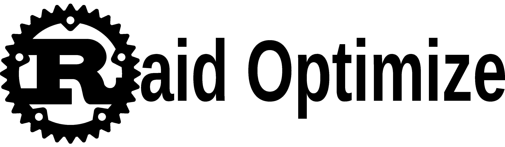
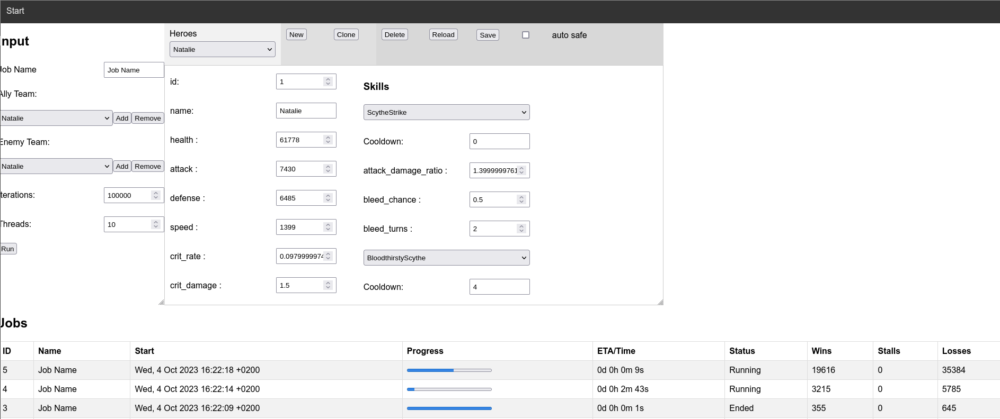

This project is dedicated to the creation of a dynamic simulator tailored for raid-style games, offering an immersive 5 vs 5 hero battle simulation experience. At its core, the project focuses on the development of a robust codebase that generates accurate results. Owing to the multitude of statistics, skills, and effects involved, predicting the outcome of a battle is far from straightforward. However, this simulator addresses this challenge, offering reliable statistical predictions regarding the strength of different team compositions.

An early-access version of the simulator, already in existence as a proof of concept, demonstrates its viability. This prototype has successfully implemented a range of integral components, including:

*    Factions (Foresters, DoomLegion, WizardsEye, SunsetSages, EternalSect, DragonTribe, HolyLightParliament, NamelessBrotherhood, TheForgotten,  SwordHarborGuards, HiddenWave)
*    Skills (ScorchedSoul, FireHeal, Resurrection, ScytheStrike, BloodthirstyScythe, EnergyBurst, ...)
*    Passives (BloodthirstyDesire, ForceOfMercy, ...)
*    Marks
*    Heroes (Natalie, Seth, Liz, Space)
*    Generic stats for heroes and generic skills

Rust, renowned for its capacity to deliver both high-performance and secure programming, will serve as the primary language for the project's implementation. That is also why the rust-artwork is used in the logo. The technical aspirations of this endeavor encompass:

*    Parallelization to optimize computation efficiency
*    Streamlined debugging processes to ensure code integrity
*    Interactive mode for inspection
*    Automized testing suite to avoid regression

## Disclaimer

The software will initially include bugs, which will be addressed over time through ongoing fixes and incoming reports. I cannot provide an assurance of an unlimited commitment to implementing all heroes in the future.

## Usage

After downloading the executable from  extracting the archive and running the executable therein should bring up a interface like below.

## Debug

You can use the debug executable preferably with `threads=1` and `iterations=1` to see what's happening in the simulation in the terminal.

## Unlock all features via SubscribeStar

https://www.subscribestar.com/apn-pucky
